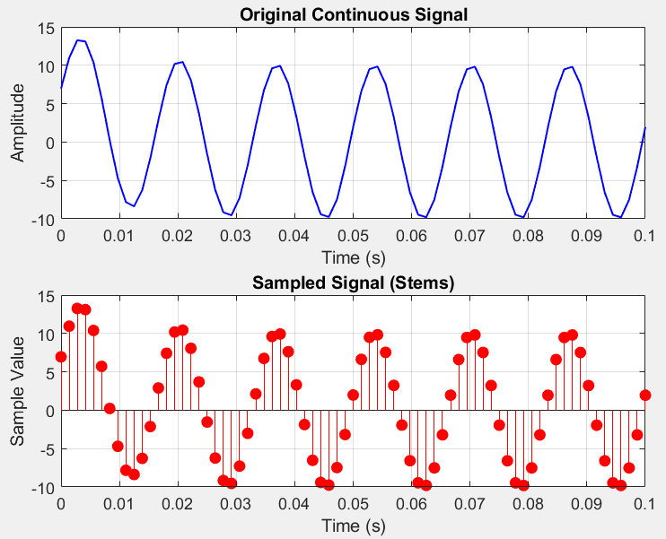
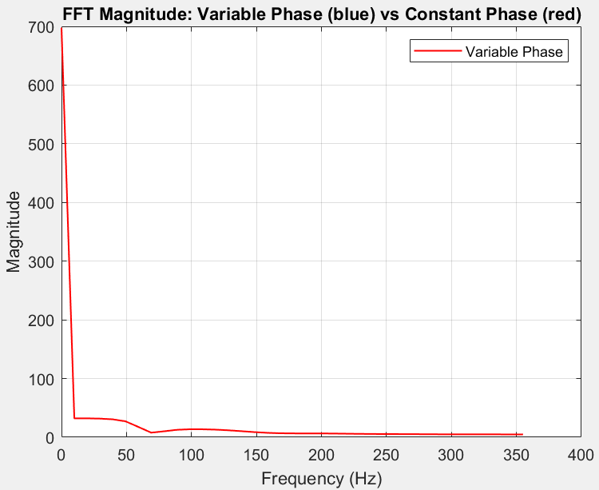
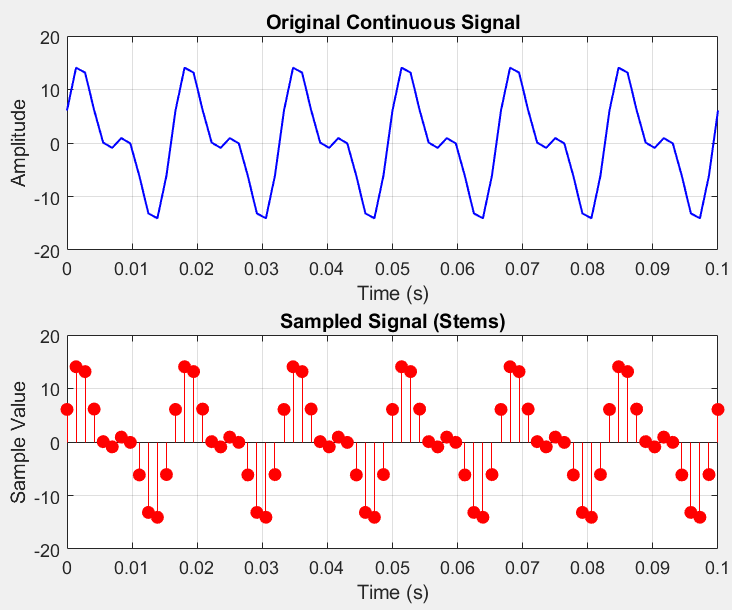
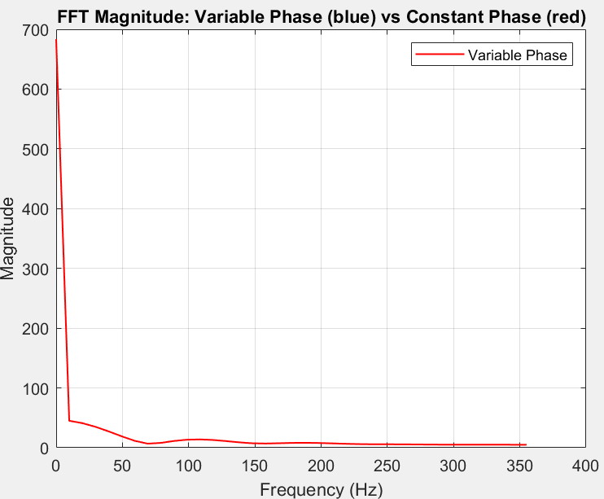
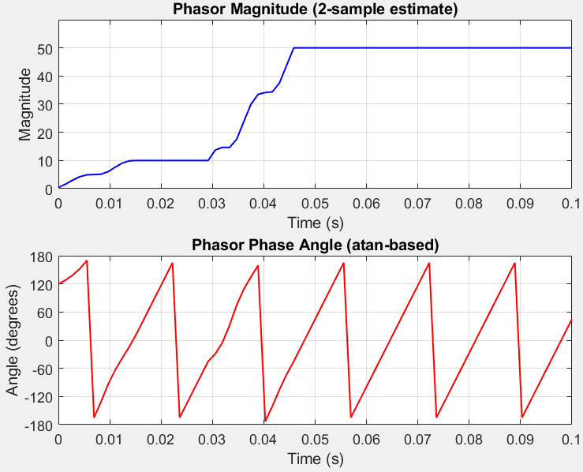
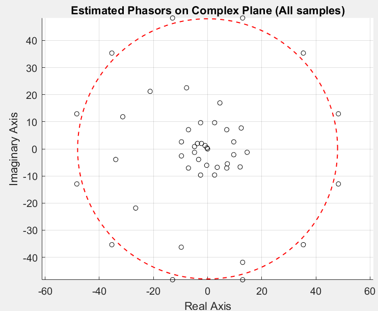

```
clc;

clear;

close all;

%%%%%%%%%%%%%%%%%%%%%%%%%%%%%%%%%%%%%%%%%%%%%%%%%%%%%%%%%

%% Initializing Variables with Parameters For Filter

fs = 720; % Sampling frequency (Hz)

T = 1 / fs; % Sampling period (s)

f0 = 60; % Signal frequency (Hz)

omega = 2 * pi * f0; % Angular frequency

%%%%%%%%%%%%%%%%%%%%%%%%%%%%%%%%%%%%%%%%%%%%%%%%%%%%%%%%%

%% Initializing Variables with Parameters For INPUT SIGNAL

fs_input = 720; % Sampling frequency (Hz)

T_input = 1 / fs; % Sampling period (s)

t_input = 0:T_input:0.1; % Time vector (0.1 seconds)

f0_input = 60; % Signal frequency (Hz)

Vm_input = 10; % Amplitude

omega_input = 2 * pi * f0_input; % Angular frequency

%%%%%%%%%%%%%%%%%%%%%%%%%%%%%%%%%%%%%%%%%%%%%%%%%%%%%%%%%

% Works with both data points and formula

% x = [714, 2218, 2314, 1233, -99, -1195, -1699, -1029, 714, 2219, 2314, 1233, -99, -1195, -1699];

x = Vm_input * sin(omega_input * t_input ); % Input waveform

% This resets the length of t if x is not an equation (data points instead)

t_input = (0:length(x)-1) * T_input;

t = (0:length(x)-1) * T_input; % Time vector (0.1 seconds)

%%%%%%%%%%%%%%%%%%%%%%%%%%%%%%%%%%%%%%%%%%%%%%%%%%%%%%%%%

% Plots the ORIGINAL Signal and SAMPLES, BEFORE FILTERING

% Top subplot: Original continuous signal

figure;

subplot(2,1,1);

plot(t_input, x, 'b', 'LineWidth', 1);

title('Original Continuous Signal');

xlabel('Time (s)');

ylabel('Amplitude');

grid on;

% Bottom subplot: Sampled signal (stem)

subplot(2,1,2);

stem(t_input, x, 'r', 'filled');

title('Sampled Signal (Stems)');

xlabel('Time (s)');

ylabel('Sample Value');

grid on;

%%%%%%%%%%%%%%%%%%%%%%%%%%%%%%%%%%%%%%%%%%%%%%%%%%%%%%%%%

% Allocate arrays to store angles and magnitude values

phase_angle_deg = zeros(1, length(t_input)-1);

mag = zeros(1, length(t_input)-1);

% Apply the 3-sample phasor magnitude and angle estimator

% This is where we actually take 3 SAMPLES and APPLY THE FILTER

real_values = [0, 0.5, 0.866, 1.0, 0.866, 0.5, 0, -0.5, -0.866, -1.0, -0.866, -0.5];

imaginary_values = [1.0, 0.866, 0.5, 0, -0.5, -0.866, -1.0, -0.866, -0.5, 0, 0.5, 0.866];

window_size = length(real_values);

V_real = zeros(1, window_size);

V_imaginary = zeros(1, window_size);

x_buffer = zeros(1, window_size); % sliding buffer for x

for n = 1:length(t)

% Slide buffer: drop oldest, append new sample

x_buffer = [x_buffer(2:end), x(n)]; % This takes all elements of x_buffer except the first one, destructures the array, then we add the result of x(n) at the end

% Apply weights to current buffer

V_real = real_values .* x_buffer;

V_imaginary = imaginary_values .* x_buffer;

imaginary_part_Vp_cos_theta = sum(V_imaginary)/(0.5 * window_size);

real_part_Vp_sin_theta = sum(V_real)/(0.5 * window_size);

phase_angle_deg(n) = atan2(imaginary_part_Vp_cos_theta, real_part_Vp_sin_theta) * 180 / pi;

mag(n) = sqrt(imaginary_part_Vp_cos_theta^2 + real_part_Vp_sin_theta^2);

end

%%%%%%%%%%%%%%%%%%%%%%%%%%%%%%%%%%%%%%%%%%%%%%%%%%%%%%%%%

% Plot: Input and Phase Angle AFTER FILTER IS APPLIED TO SIGNAL

figure;

subplot(2,1,1);

plot(t, mag, 'b', 'LineWidth', 1);

title('Phasor Magnitude (2-sample estimate)');

xlabel('Time (s)');

ylabel('Magnitude');

ylim([0, max(mag) + max(mag) * 0.2]);

grid on;

subplot(2,1,2);

plot(t, phase_angle_deg, 'r', 'LineWidth', 1);

title('Phasor Phase Angle (atan-based)');

xlabel('Time (s)');

ylabel('Angle (degrees)');

ylim([-180 180]);

yticks(-180:60:180); % Set Y-axis ticks at 50-degree intervals

grid on;

%%%%%%%%%%%%%%%%%%%%%%%%%%%%%%%%%%%%%%%%%%%%%%%%%%%%%%%%%

% PLOTS CIRCLE GRAPH WITH REAL AND IMAGINARY VALUES OF FILTERED SIGNAL

% We need to account for every sample that needs to be plotted on real/imaginary plane

% Not only every sample, but every sample for multiple cycles for time t

samples_per_cycle = round(fs / f0);

num_cycles = floor((length(t)-1) / samples_per_cycle);

idx_all = 1:(length(t)-1);

% Compute phasor coordinates

phasor_real = mag .* cosd(phase_angle_deg);

phasor_imag = mag .* sind(phase_angle_deg);

% Plot

figure; hold on; axis equal;

% Ideal red dashed circle

theta = linspace(0, 2*pi, 300);

plot(round(max(abs(x))) * cos(theta), round(max(abs(x))) * sin(theta), 'r--', 'LineWidth', 1);

% Origin point

plot(0, 0, 'ko', 'MarkerFaceColor', 'none', 'MarkerSize', 4.5);

% All phasor dots (black hollow circles)

plot(phasor_real(idx_all), phasor_imag(idx_all), 'ko', 'MarkerFaceColor', 'none', 'MarkerSize', 4.5);

grid on;

xlabel('Real Axis');

ylabel('Imaginary Axis');

title('Estimated Phasors on Complex Plane (All samples)');

hold off;

%%%%%%%%%%%%%%%%%%%%%%%%%%%%%%%%%%%%%%%%%%%%%%%%%%%%%%%%%

% Plot Frequency Analysis of Estimated Phasor using FFT

phasor_complex = mag .* exp(1j * deg2rad(phase_angle_deg)); % Variable phase

phasor_const_phase = mag; % constant phase

N = length(phasor_complex);

half = N/2 + 1;

Y_const = fft(phasor_const_phase);

Y_const_mag = abs(Y_const);

Y_const_mag = Y_const_mag(1:half);

f = (0:half-1) * fs / N;

% Plot

figure;

plot(f, Y_const_mag, 'r-', 'LineWidth', 1);

xlabel('Frequency (Hz)');

ylabel('Magnitude');

title('FFT Magnitude: Variable Phase (blue) vs Constant Phase (red)');

legend('Variable Phase','Constant Phase');

grid on;
```


### Pure Sine Wave:
(First image below is the "wrong version" that matches lecture notes. Just posting it here for reference to show that it matches.)


### Decaying DC:





### 2nd Harmonic:




### 3rd Harmonic:


### Transient:






