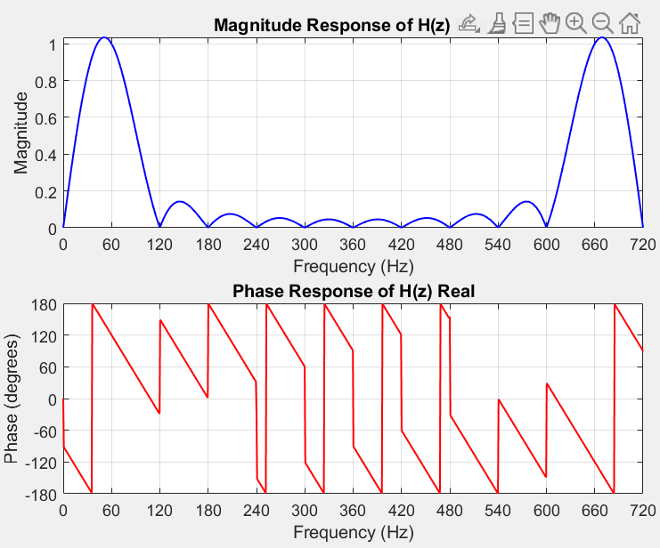
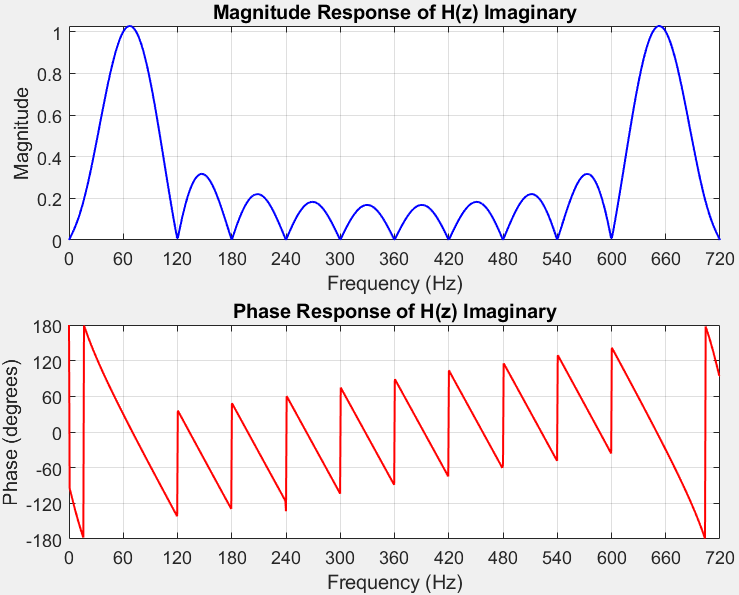

```
clc;

clear;

close all;

%%%%%%%%%%%%%%%%%%%%%%%%%%%%%%%%%%%%%%%%%%%%%%%%%%%%%%%%%

%% Initializing Variables with Parameters

fs = 720; % Sampling frequency

T = 1 / fs; % Sampling period

f0 = 60;

samples = fs/f0;

cycles = samples/f0;

f = linspace(0, fs, 1000); % Frequency range for plotting

omega = 2 * pi * f; % Discrete angular frequency (radians/sample)

%%%%%%%%%%%%%%%%%%%%%%%%%%%%%%%%%%%%%%%%%%%%%%%%%%%%%%%%%

z = exp(1j * omega * T);

% --- H(z) REAL PART Vp COS(Theta) --- The singal itself can be sine or cos

real_values = sin((2 * pi * f0)*(0:T:cycles));

real_values = real_values(1:samples);

quarter_of_real = floor(length(real_values)/4);

% Imaginary values are dervied from real values

imaginary_values = circshift(real_values, [0, -quarter_of_real]); % Performa a circular shift of the first 1/4N elements

real_values = flip(real_values);

% Length of real and imaginary should be the same, so let's pick real for

% sample length.

N = length(real_values);

H_real = zeros(1,length(z));

% --- H(z) IMAGINARY PART Vp SIN(Theta) --- The singal itself can be sine or cos

imaginary_values = flip(imaginary_values);

H_imaginary = zeros(1,length(z));

% Determine H(z) values for real and imaginary

for n = N:-1:1

H_real = H_real + real_values(n) * z.^(-(n-1));

H_imaginary = H_imaginary + imaginary_values(n) * z.^(-(n-1));

% Printing order of H(z) to confirm consecutive order

fprintf("HRe(z) = " + num2str(real_values(n)) + " * z^" + num2str(-(n-1)));

fprintf(" || ");

fprintf("HIm(z) = " + num2str(imaginary_values(n)) + " * z^" + num2str(-(n-1)));

disp(" ");

end

% Divide real and imaginary values by 1/2 N because the mangnitude is too high.

H_real = H_real/(N/2);

H_imaginary = H_imaginary/(N/2);

% Magnitude of real

mag_H_real = abs(H_real);

% Phase of real

phase_angle_H_real = atan2(imag(H_real), real(H_real)) * 180 / pi;

%%%%%%%%%%%%%%%%%%%%%%%%%%%%%%%%%%%%%%%%%%%%%%%%%%%%%%%%%

% Plot magnitude and phase of H

figure;

subplot(2,1,1);

plot(f, mag_H_real, 'b', 'LineWidth', 1);

xlabel('Frequency (Hz)');

ylabel('Magnitude');

title('Magnitude Response of H1(z) Real');

grid on;

xticks(0:60:fs);

xlim([0 fs]);

subplot(2,1,2);

plot(f, phase_angle_H_real, 'r', 'LineWidth', 1);

xlabel('Frequency (Hz)');

ylabel('Phase (degrees)');

title('Phase Response of H1(z) Real');

grid on;

xticks(0:60:fs);

xlim([0 fs]);

yticks(-180:60:180);

ylim([-180 180]);

%%%%%%%%%%%%%%%%%%%%%%%%%%%%%%%%%%%%%%%%%%%%%%%%%%%%%%%%%

% --- H2(z) IMAGINARY PART Vp Sin(Theta) ---

mag_H_imaginary = abs(H_imaginary);

phase_angle_H_imaginary = atan2(imag(H_imaginary), real(H_imaginary)) * 180 / pi; % will be zero everywhere

%%%%%%%%%%%%%%%%%%%%%%%%%%%%%%%%%%%%%%%%%%%%%%%%%%%%%%%%%

% Plot magnitude and phase of H2

figure;

subplot(2,1,1);

plot(f, mag_H_imaginary, 'b', 'LineWidth', 1);

xlabel('Frequency (Hz)');

ylabel('Magnitude');

title('Magnitude Response of H2(z) Imaginary');

grid on;

xticks(0:60:fs);

xlim([0 fs]);

subplot(2,1,2);

plot(f, phase_angle_H_imaginary, 'r', 'LineWidth', 1);

xlabel('Frequency (Hz)');

ylabel('Phase (degrees)');

title('Phase Response of H2(z) Imaginary');

grid on;

xticks(0:60:fs);

xlim([0 fs]);

yticks(-180:60:180);

ylim([-180 180]);
```




