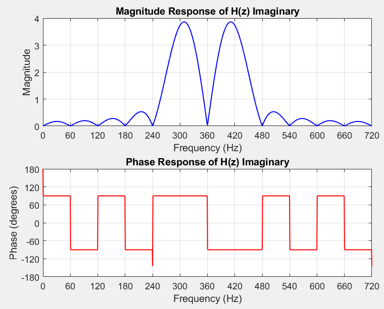

```
clc;

clear;

close all;

%%%%%%%%%%%%%%%%%%%%%%%%%%%%%%%%%%%%%%%%%%%%%%%%%%%%%%%%%

%% Initializing Variables with Parameters

%#ok<*UNRCH>

fs = 720; % Sampling frequency

f0 = 60; % Filter Frequency

T = 1 / fs; % Sampling period

omega = 2 * pi * f0; % Discrete angular frequency (radians/sample)

f_range = linspace(0, fs, 1000); % Frequency range to plot full range. This is only relevant later on when assigning z = exp(j omega T)

%%%%%%%%%%%%%%%%%%%%%%%%%%%%%%%%%%%%%%%%%%%%%%%%%%%%%%%%%

% LES filter generator

filter_choice = 0; % Default initialization

track_active_filter = []; % For error handeling for user selection of filter

% Decide which filter to ACTIVATE. Manually configured filters.

fundamental_filter = true;

second_harmonic_filter = false;

third_harmonic_filter = true;

fourth_harmonic_filter = false;

fifth_harmonic_filter = false;

sixth_harmonic_filter = false;

dc_filter = true;

% Add to tracker only if true

if fundamental_filter, track_active_filter(end + 1) = 1; end

if second_harmonic_filter, track_active_filter(end + 1) = 2; end

if third_harmonic_filter, track_active_filter(end + 1) = 3; end

if fourth_harmonic_filter, track_active_filter(end + 1) = 4; end

if fifth_harmonic_filter, track_active_filter(end + 1) = 5; end

if sixth_harmonic_filter, track_active_filter(end + 1) = 6; end

if dc_filter, track_active_filter(end + 1) = 7; end

%-----------------------------------------------------------

% Decide which filter to TARGET/APPLY (Only activate one)

filters = {"fundamental", "2ndHarmonic", "3rdHarmonic", "4thHarmonic", "5thHarmonic", "6thHarmonic", "DC"};

filter_choice = 1; % FUNDAMENAL

% filter_choice = 2; % 2nd Harmonic

% filter_choice = 3; % 3rd Harmonic

% filter_choice = 4; % 4th Harmonic

% filter_choice = 5; % 5th Harmonic

% filter_choice = 6; % 6th Harmonic

% filter_choice = 7; % DC

if ~ismember(filter_choice, track_active_filter)

error('YOU CHOSE A FILTER THAT YOU DID NOT ACTIVATE!');

end

target_filter = filters{filter_choice};

%-----------------------------------------------------------

sample_offset = 3; % Change this to whatever you need. Prof said it should be minimum 1.

% Initialize sample count

samples = 0 + sample_offset;

% Add 2 for each active filter.

if fundamental_filter, samples = samples + 2; end

if second_harmonic_filter, samples = samples + 2; end

if third_harmonic_filter, samples = samples + 2; end

if fourth_harmonic_filter, samples = samples + 2; end

if fifth_harmonic_filter, samples = samples + 2; end

if sixth_harmonic_filter, samples = samples + 2; end

if dc_filter, samples = samples + 2; end

window = samples; % In case you want custom window size, can change it here manually

matrix_A = [];

z_power = -1 * (window - 1)/2; % Assumes window will always be an odd number so that the center becomes V0, then even amouns before and after.

real_values = []; % Real part of filter. H(z) Vp Cos(Theta)

imaginary_values = []; % Imaginary part of filter. H(z) Vp Sin(Theta)

for n = 1:window

array_of_equations = []; % Reset at the beginning of each loop

if fundamental_filter

array_of_equations(end + 1) = sin(omega * T * z_power);

array_of_equations(end + 1) = cos(omega * T * z_power);

end

if second_harmonic_filter

array_of_equations(end + 1) = sin(2 * omega * T * z_power);

array_of_equations(end + 1) = cos(2 * omega * T * z_power);

end

if third_harmonic_filter

array_of_equations(end + 1) = sin(3 * omega * T * z_power);

array_of_equations(end + 1) = cos(3 * omega * T * z_power);

end

if fourth_harmonic_filter

array_of_equations(end + 1) = sin(4 * omega * T * z_power);

array_of_equations(end + 1) = cos(4 * omega * T * z_power);

end

if fifth_harmonic_filter

array_of_equations(end + 1) = sin(5 * omega * T * z_power);

array_of_equations(end + 1) = cos(5 * omega * T * z_power);

end

if sixth_harmonic_filter

array_of_equations(end + 1) = sin(6 * omega * T * z_power);

array_of_equations(end + 1) = cos(6 * omega * T * z_power);

end

if dc_filter

array_of_equations(end + 1) = 1;

array_of_equations(end + 1) = 1 * z_power;

end

% Insert nth row into matrix_A at row `n`

matrix_A(n, :) = array_of_equations;

z_power = z_power + 1;

end

target_array_location = 1;

% Perform left pseudo inverse on matrix A

A_left_pinv = pinv(matrix_A);

% Extract specific TARGET real and imaginary filters from matrix A

for i = 1:length(filters)

current_filter = filters{i};

if strcmp(target_filter, current_filter)

switch current_filter

case {"fundamental", "2ndHarmonic", "3rdHarmonic", "4thHarmonic", "5thHarmonic", "6thHarmonic", "DC"}

real_values = A_left_pinv(target_array_location, :);

imaginary_values = A_left_pinv(target_array_location + 1, :);

end

end

% Only increment for filters that are in the active list

if ismember(i, track_active_filter)

target_array_location = target_array_location + 2;

end

end

fprintf("Full matrix A BEFORE left pseudo inverse:");

fprintf("\n");

disp(matrix_A);

fprintf("Full matrix A AFTER left pseudo inverse:");

fprintf("\n");

disp(A_left_pinv);

fprintf("\n");

fprintf("First row below is real values. Second row below is Imaginary. Filter choice is: %s\n", target_filter);

fprintf("\n");

disp(real_values);

disp(imaginary_values);

%%%%%%%%%%%%%%%%%%%%%%%%%%%%%%%%%%%%%%%%%%%%%%%%%%%%%%%%%

z = exp(1j * 2 * pi * f_range * T);

% --- H(z) REAL PART Vp COS(Theta) --- The singal itself can be sine or cos

% Length of real and imaginary should be the same, so let's pick real for

% sample length.

z_power = -1 * (window - 1)/2;

N = length(real_values);

H_real = zeros(1,length(z));

H_imaginary = zeros(1,length(z));

% Determine H(z) values for real and imaginary

for n = 1:N

H_real = H_real + real_values(n) * z.^(z_power);

H_imaginary = H_imaginary + imaginary_values(n) * z.^(z_power);

% Printing order of H(z) to confirm consecutive order

fprintf("HRe(z) = " + num2str(real_values(n)) + " * z^" + num2str(z_power));

fprintf(" || ");

fprintf("HIm(z) = " + num2str(imaginary_values(n)) + " * z^" + num2str(z_power));

disp(" ");

z_power = z_power + 1;

end

% Magnitude of real

mag_H_real = abs(H_real);

% Phase of real

phase_angle_H_real = atan2(imag(H_real), real(H_real)) * 180 / pi;

%%%%%%%%%%%%%%%%%%%%%%%%%%%%%%%%%%%%%%%%%%%%%%%%%%%%%%%%%

% Plot magnitude and phase of H

figure;

subplot(2,1,1);

plot(f_range, mag_H_real, 'b', 'LineWidth', 1);

xlabel('Frequency (Hz)');

ylabel('Magnitude');

title('Magnitude Response of H(z) Real');

grid on;

xticks(0:f0:fs);

xlim([0 fs]);

subplot(2,1,2);

plot(f_range, phase_angle_H_real, 'r', 'LineWidth', 1);

xlabel('Frequency (Hz)');

ylabel('Phase (degrees)');

title('Phase Response of H(z) Real');

grid on;

xticks(0:f0:fs);

xlim([0 fs]);

yticks(-180:60:180);

ylim([-180 180]);

%%%%%%%%%%%%%%%%%%%%%%%%%%%%%%%%%%%%%%%%%%%%%%%%%%%%%%%%%

% --- H2(z) IMAGINARY PART Vp Sin(Theta) ---

% Magnitude of imaginary

mag_H_imaginary = abs(H_imaginary);

% Phase of imaginary

phase_angle_H_imaginary = atan2(imag(H_imaginary), real(H_imaginary)) * 180 / pi; % will be zero everywhere

%%%%%%%%%%%%%%%%%%%%%%%%%%%%%%%%%%%%%%%%%%%%%%%%%%%%%%%%%

% Plot magnitude and phase of H2

figure;

subplot(2,1,1);

plot(f_range, mag_H_imaginary, 'b', 'LineWidth', 1);

xlabel('Frequency (Hz)');

ylabel('Magnitude');

title('Magnitude Response of H(z) Imaginary');

grid on;

xticks(0:f0:fs);

xlim([0 fs]);

subplot(2,1,2);

plot(f_range, phase_angle_H_imaginary, 'r', 'LineWidth', 1);

xlabel('Frequency (Hz)');

ylabel('Phase (degrees)');

title('Phase Response of H(z) Imaginary');

grid on;

xticks(0:f0:fs);

xlim([0 fs]);

yticks(-180:60:180);

ylim([-180 180]);

%%%%%%%%%%%%%%%%%%%%%%%%%%%%%%%%%%%%%%%%%%%%%%%%%%%%%%%%%

% Plot overlapping magnitudes of H_real and H_imaginary

figure;

plot(f_range, mag_H_real, 'b', 'LineWidth', 1.5); hold on;

plot(f_range, mag_H_imaginary, 'r--', 'LineWidth', 1.5);

xlabel('Frequency (Hz)');

ylabel('Magnitude');

title('Magnitude Response: Real vs Imaginary Parts of H(z)');

legend('Real Part', 'Imaginary Part');

grid on;

xticks(0:f0:fs);

xlim([0 fs]);
```


### 60Hz Filter:


### 120Hz Filter:


### 180Hz Filter:


### 240Hz Filter:


### DC Filter:




