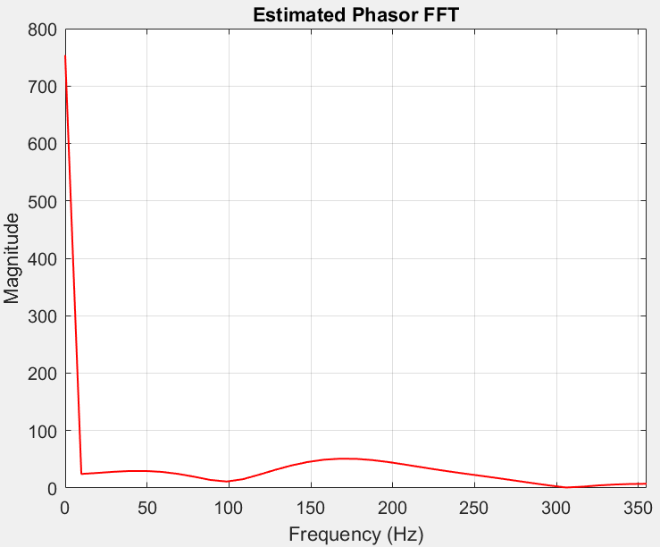

```
clc;

clear;

close all;

%%%%%%%%%%%%%%%%%%%%%%%%%%%%%%%%%%%%%%%%%%%%%%%%%%%%%%%%%

%% Initializing Variables with Parameters For INPUT SIGNAL

fs_input = 720; % Sampling frequency (Hz)

T_input = 1 / fs_input; % Sampling period (s)

f0_input = 60; % Signal frequency (Hz)

t_input = 0:T_input:((fs_input/f0_input)/2)/f0_input; % Time vector (0.1 seconds)

Vm_input = 10; % Amplitude

omega_input = 2 * pi * f0_input; % Angular frequency

datapoints = true;

%%%%%%%%%%%%%%%%%%%%%%%%%%%%%%%%%%%%%%%%%%%%%%%%%%%%%%%%%

%% Initializing Variables with Parameters FOR FILTER

%#ok<*UNRCH>

fs = fs_input; % Sampling frequency

f0 = f0_input; % Filter Frequency

T = 1 / fs; % Sampling period

omega = 2 * pi * f0; % Discrete angular frequency (radians/sample)

f_range = linspace(0, fs, 1000); % Frequency range to plot full range. This is only relevant later on when assigning z = exp(j omega T)

%%%%%%%%%%%%%%%%%%%%%%%%%%%%%%%%%%%%%%%%%%%%%%%%%%%%%%%%%

% Input data points

x = [714, 2218, 2314, 1233, -99, -1195, -1699, -1029, 714, 2219, 2314, 1233, -99, -1195, -1699];

% x = Vm_input * sin(omega_input * t_input + pi/18 ); % Input waveform

% datapoints = false;

t_input = 0:T_input:((length(x)-1) * T_input);

%%%%%%%%%%%%%%%%%%%%%%%%%%%%%%%%%%%%%%%%%%%%%%%%%%%%%%%%%

% Plots the ORIGINAL Signal and SAMPLES, BEFORE FILTERING

% Top subplot: Original continuous signal

figure;

subplot(2,1,1);

plot(t_input, x, 'b', 'LineWidth', 1);

title('Original Continuous Signal');

xlabel('Time (s)');

if(datapoints)

xlim([t_input(1), t_input(end)]);

xticks(0:T_input:t_input(end))

xtickformat('%.4f'); % shows more precise decimals

end

ylabel('Amplitude');

grid on;

% Bottom subplot: Sampled signal (stem)

subplot(2,1,2);

stem(t_input, x, 'r', 'filled');

title('Sampled Signal (Stems)');

xlabel('Time (s)');

if(datapoints)

xlim([t_input(1), t_input(end)]);

xticks(0:T_input:t_input(end))

xtickformat('%.4f'); % shows more precise decimals

end

ylabel('Sample Value');

grid on;

%%%%%%%%%%%%%%%%%%%%%%%%%%%%%%%%%%%%%%%%%%%%%%%%%%%%%%%%%

% LES filter generator

filter_choice = 0; % Default initialization

track_active_filter = []; % For error handeling for user selection of filter

% Decide which filter to ACTIVATE. Manually configured filters.

fundamental_filter = true;

second_harmonic_filter = true;

third_harmonic_filter = true;

fourth_harmonic_filter = true;

fifth_harmonic_filter = false;

sixth_harmonic_filter = false;

dc_filter = true;

% Add to tracker only if true

if fundamental_filter, track_active_filter(end + 1) = 1; end

if second_harmonic_filter, track_active_filter(end + 1) = 2; end

if third_harmonic_filter, track_active_filter(end + 1) = 3; end

if fourth_harmonic_filter, track_active_filter(end + 1) = 4; end

if fifth_harmonic_filter, track_active_filter(end + 1) = 5; end

if sixth_harmonic_filter, track_active_filter(end + 1) = 6; end

if dc_filter, track_active_filter(end + 1) = 7; end

%-----------------------------------------------------------

% Decide which filter to TARGET/APPLY (Only activate one)

filters = {"fundamental", "2ndHarmonic", "3rdHarmonic", "4thHarmonic", "5thHarmonic", "6thHarmonic", "DC"};

filter_choice = 1; % FUNDAMENAL

% filter_choice = 2; % 2nd Harmonic

% filter_choice = 3; % 3rd Harmonic

% filter_choice = 4; % 4th Harmonic

% filter_choice = 5; % 5th Harmonic

% filter_choice = 6; % 5th Harmonic

% filter_choice = 7; % DC

if ~ismember(filter_choice, track_active_filter)

error('YOU CHOSE A FILTER THAT YOU DID NOT ACTIVATE!');

end

target_filter = filters{filter_choice};

%-----------------------------------------------------------

sample_offset = 1; % Change this to whatever you need. Prof said it should be minimum 1.

% Initialize sample count

samples = sample_offset;

% Add 2 for each active filter.

if fundamental_filter, samples = samples + 2; end

if second_harmonic_filter, samples = samples + 2; end

if third_harmonic_filter, samples = samples + 2; end

if fourth_harmonic_filter, samples = samples + 2; end

if fifth_harmonic_filter, samples = samples + 2; end

if sixth_harmonic_filter, samples = samples + 2; end

if dc_filter, samples = samples + 2; end

window = samples; % In case you want custom window size, can change it here manually

matrix_A = [];

z_power = -1 * (window - 1)/2; % Assumes window will always be an odd number so that the center becomes V0, then even amouns before and after.

real_values = []; % Real part of filter. H(z) Vp Cos(Theta)

imaginary_values = []; % Imaginary part of filter. H(z) Vp Sin(Theta)

for n = 1:window

array_of_equations = []; % Reset at the beginning of each loop

if fundamental_filter

array_of_equations(end + 1) = sin(omega * T * z_power);

array_of_equations(end + 1) = cos(omega * T * z_power);

end

if second_harmonic_filter

array_of_equations(end + 1) = sin(2 * omega * T * z_power);

array_of_equations(end + 1) = cos(2 * omega * T * z_power);

end

if third_harmonic_filter

array_of_equations(end + 1) = sin(3 * omega * T * z_power);

array_of_equations(end + 1) = cos(3 * omega * T * z_power);

end

if fourth_harmonic_filter

array_of_equations(end + 1) = sin(4 * omega * T * z_power);

array_of_equations(end + 1) = cos(4 * omega * T * z_power);

end

if fifth_harmonic_filter

array_of_equations(end + 1) = sin(5 * omega * T * z_power);

array_of_equations(end + 1) = cos(5 * omega * T * z_power);

end

if sixth_harmonic_filter

array_of_equations(end + 1) = sin(6 * omega * T * z_power);

array_of_equations(end + 1) = cos(6 * omega * T * z_power);

end

if dc_filter

array_of_equations(end + 1) = 1;

array_of_equations(end + 1) = 1 * z_power;

end

% Insert nth row into matrix_A at row `n`

matrix_A(n, :) = array_of_equations;

z_power = z_power + 1;

end

target_array_location = 1;

% Perform left pseudo inverse on matrix A

A_left_pinv = pinv(matrix_A);

% Extract specific TARGET real and imaginary filters from matrix A

for i = 1:length(filters)

current_filter = filters{i};

if strcmp(target_filter, current_filter)

switch current_filter

case {"fundamental", "2ndHarmonic", "3rdHarmonic", "4thHarmonic", "5thHarmonic","6thHarmonic", "DC"}

real_values = A_left_pinv(target_array_location, :);

imaginary_values = A_left_pinv(target_array_location + 1, :);

end

end

% Only increment for filters that are in the active list

if ismember(i, track_active_filter)

target_array_location = target_array_location + 2;

end

end

%-----------------------------------------------------------

% Initialize Data Table

col_names = {'Input','Real Filter','Input * Real Vals','Filtered Real Part', 'Imag Filter','Input * Imag Vals','Filtered Imag Part','Vp', 'Phase Angle(deg)'};

array_for_table_columns = length(col_names);

array_for_table_rows = samples;

array_for_table = zeros(array_for_table_rows, array_for_table_columns);

array_for_table(1:samples, 1) = x(1:samples);

fprintf("Full matrix A after left pseudo inverse:");

fprintf("\n");

disp(A_left_pinv);

fprintf("\n");

fprintf("First row below is real values. Second row below is Imaginary. Filter choice is: %s\n", target_filter);

fprintf("\n");

disp(real_values);

disp(imaginary_values);

%%%%%%%%%%%%%%%%%%%%%%%%%%%%%%%%%%%%%%%%%%%%%%%%%%%%%%%%%

% Allocate arrays to store angles and magnitude values

phase_angle_deg = zeros(1, length(t_input));

mag = zeros(1, length(t_input));

% Apply the 3-sample phasor magnitude and angle estimator

% This is where we actually take 3 SAMPLES and APPLY THE FILTER

window_size = samples; % Window size is same as sample size

V_real = zeros(1, window_size);

V_imaginary = zeros(1, window_size);

x_buffer = zeros(1, window_size); % sliding buffer for x

for n = 1:length(t_input)

% Slide buffer: drop oldest, append new sample

x_buffer = [x_buffer(2:end), x(n)]; % This takes all elements of x_buffer except the first one, destructures the array, then we add the result of x(n) at the end

% Apply weights to current buffer

V_real = real_values .* x_buffer;

V_imaginary = imaginary_values .* x_buffer;

imaginary_part_Vp_cos_theta = sum(V_imaginary);

real_part_Vp_sin_theta = sum(V_real);

phase_angle_deg(n) = atan2(imaginary_part_Vp_cos_theta, real_part_Vp_sin_theta) * 180 / pi;

mag(n) = sqrt(imaginary_part_Vp_cos_theta^2 + real_part_Vp_sin_theta^2);

if(n == window_size)

% Insert real and imaginary filter values into columns of table

array_for_table(1:window_size, 2) = round(real_values(1:window_size), 4);

array_for_table(1:window_size, 5) = round(imaginary_values(1:window_size), 4);

% Insert calculated values into columns for table after calculation is done.

array_for_table(1:window_size, 3) = round(V_real(1:window_size));

array_for_table(1:window_size, 6) = round(V_imaginary(1:window_size));

array_for_table(1:window_size, 4) = round(cumsum(V_real(1:window_size)));

array_for_table(1:window_size, 7) = round(cumsum(V_imaginary(1:window_size)));

% Insert magnitude and phase into columns of table (no rounding)

array_for_table(1:window_size, 8) = mag(1:window_size);

array_for_table(1:window_size, 9) = phase_angle_deg(1:window_size);

end

end

%%%%%%%%%%%%%%%%%%%%%%%%%%%%%%%%%%%%%%%%%%%%%%%%%%%%%%%%%

% Plot: Input and Phase Angle AFTER FILTER IS APPLIED TO SIGNAL

figure;

subplot(2,1,1);

plot(t_input, mag, 'b', 'LineWidth', 1);

title('Phasor Magnitude');

xlabel('Time (s)');

if(datapoints)

xlim([t_input(1), t_input(end)]);

xticks(0:T_input:t_input(end))

xtickformat('%.4f'); % shows more precise decimals

end

ylabel('Magnitude');

ylim([0, max(mag) + max(mag) * 0.2]);

grid on;

subplot(2,1,2);

plot(t_input, phase_angle_deg, 'r', 'LineWidth', 1);

title('Phasor Phase Angle');

xlabel('Time (s)');

if(datapoints)

xlim([t_input(1), t_input(end)]);

xticks(0:T_input:t_input(end))

xtickformat('%.4f'); % shows more precise decimals

end

ylabel('Angle (degrees)');

ylim([-180 180]);

yticks(-180:60:180); % Set Y-axis ticks at 50-degree intervals

grid on;

%%%%%%%%%%%%%%%%%%%%%%%%%%%%%%%%%%%%%%%%%%%%%%%%%%%%%%%%%

% PLOTS CIRCLE GRAPH WITH REAL AND IMAGINARY VALUES OF FILTERED SIGNAL

% We need to account for every sample that needs to be plotted on real/imaginary plane

% Not only every sample, but every sample for multiple cycles for time t_input

samples_per_cycle = round(fs_input / f0_input);

num_cycles = floor((length(t_input)) / samples_per_cycle);

idx_all = 1:(length(t_input));

% Compute phasor coordinates

phasor_real = mag .* cosd(phase_angle_deg);

phasor_imag = mag .* sind(phase_angle_deg);

% Plot

figure; hold on; axis equal;

% Ideal red dashed circle

theta = linspace(0, 2*pi, 300);

plot(round(max(abs(x))) * cos(theta), round(max(abs(x))) * sin(theta), 'r--', 'LineWidth', 1);

% Origin point

plot(0, 0, 'ko', 'MarkerFaceColor', 'none', 'MarkerSize', 4.5);

% All phasor dots (black hollow circles)

plot(phasor_real(idx_all), phasor_imag(idx_all), 'ko', 'MarkerFaceColor', 'none', 'MarkerSize', 4.5);

grid on;

xlabel('Real Axis');

ylabel('Imaginary Axis');

title('Estimated Phasors on Complex Plane');

hold off;

%%%%%%%%%%%%%%%%%%%%%%%%%%%%%%%%%%%%%%%%%%%%%%%%%%%%%%%%%

% Plot Frequency Analysis of Estimated Phasor using FFT

phasor_complex = mag .* exp(1j * deg2rad(phase_angle_deg)); % Variable phase

phasor_const_phase = mag; % constant phase

N = length(phasor_complex);

half = N/2 + 1;

Y_const = fft(phasor_const_phase);

Y_const_mag = abs(Y_const);

Y_const_mag = Y_const_mag(1:half);

f = (0:half-1) * fs_input / N;

% Plot

figure;

plot(f, Y_const_mag, 'r-', 'LineWidth', 1);

xlabel('Frequency (Hz)');

xlim([f(1), f(end)]);

ylabel('Magnitude');

title('Estimated Phasor FFT');

grid on;

%%%%%%%%%%%%%%%%%%%%%%%%%%%%%%%%%%%%%%%%%%%%%%%%%%%%%%%%%

% Customize & print table

my_table = array2table(array_for_table, 'VariableNames', col_names);

% Create figure with a reasonable size

fig = figure('Name', sprintf('Values In Window For First %d Samples', samples), 'NumberTitle', 'off', 'Position', [100, 100, 900, 300]); % [left bottom width height]

% Convert numeric data to cell array of strings with full precision

formattedData = compose('%.15g', my_table{:,:}); % 15 digits, avoid sci notation

formattedData = reshape(formattedData, size(my_table{:,:}));

% Get numeric matrix from table so that I can remove decimals from column 8 and 9

numericData = my_table{:,:};

[numRows, numCols] = size(numericData);

% Initialize cell array to hold formatted strings

formattedData = strings(numRows, numCols);

% Format each column

for col = 1:numCols

if col == 8 || col == 9

% No decimals for columns 8 and 9

formattedData(:, col) = compose('%d', round(numericData(:, col)));

else

% Full precision for all other columns

formattedData(:, col) = compose('%.15g', numericData(:, col));

end

end

% Convert to cell array

formattedData = cellstr(formattedData);

formattedData = reshape(formattedData, size(numericData));

% Set column widths

baseWidth = 70;

colWidths = repmat({baseWidth * 1.5}, 1, numCols);

% Display table

t = uitable('Parent', fig,'Data', formattedData,'ColumnName', my_table.Properties.VariableNames, 'Units', 'normalized', 'Position', [0 0 1 1], 'RowName', [], 'ColumnWidth', colWidths);
```


### Pure Sine:


### Decaying DC:


### 2nd Harmonic:


### 3rd Harmonic:





### 4th Harmonic:


### 5th Harmonic:


### Transient:


