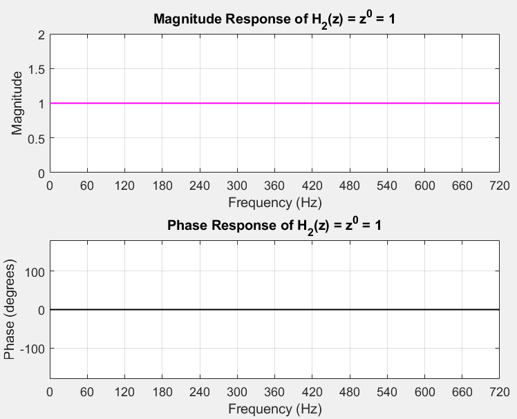
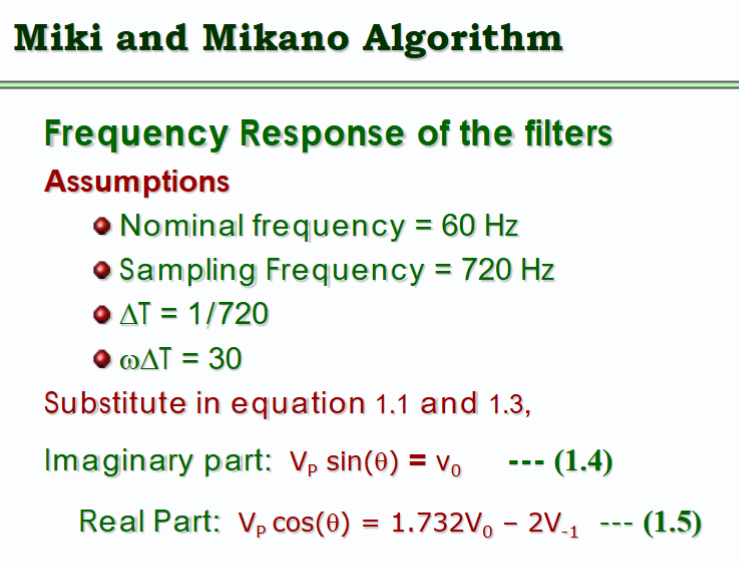
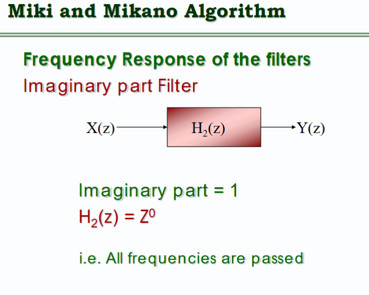
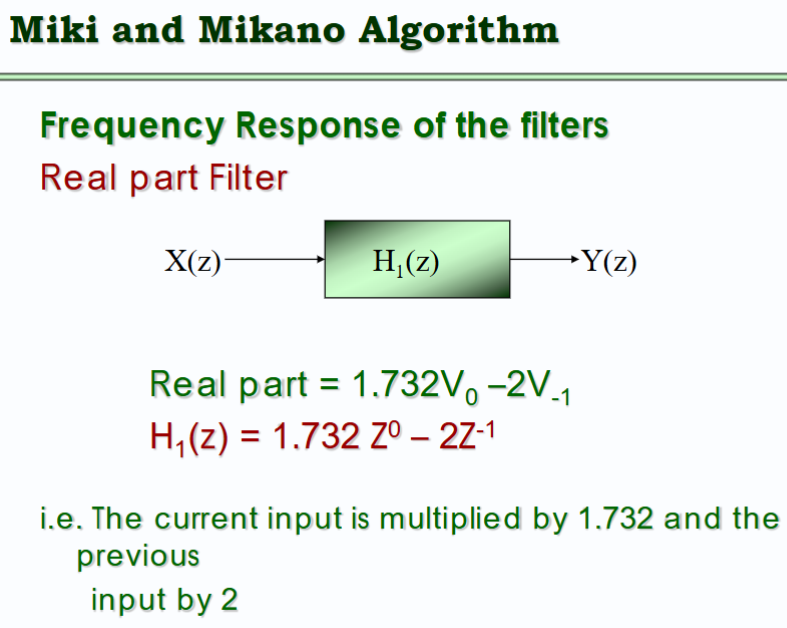
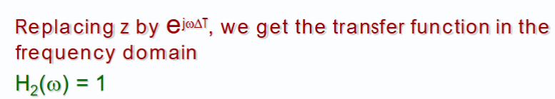
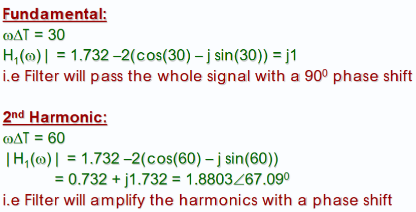

```
fs = 720; % Sampling frequency

T = 1 / fs; % Sampling period

f = linspace(0, fs, 1000); % Frequency range for plotting

omega = 2 * pi * f * T; % Discrete angular frequency (radians/sample)

% --- H(z) = 1.732*1 - 2*z^(-1) ---

z = exp(1j * omega);

H = 1.732 * z.^0 - 2 * z.^(-1);

mag = abs(H);

phi = atan2(imag(H), real(H)) * 180 / pi;

% Phase correction for H

phi_start = phi(1);

phi_end = phi(end);

phi_baseline = linspace(phi_start, phi_end, length(phi));

phi_corrected = phi_baseline - phi;

% Plot magnitude and phase of H

figure;

subplot(2,1,1);

plot(f, mag, 'b', 'LineWidth', 1);

xlabel('Frequency (Hz)');

ylabel('Magnitude');

title('Magnitude Response of H(z) = 1.732 - 2 z^{-1}');

grid on;

xticks(0:60:720);

xlim([0 720]);

subplot(2,1,2);

plot(f, phi_corrected, 'r', 'LineWidth', 1);

xlabel('Frequency (Hz)');

ylabel('Phase (degrees)');

title('Corrected Phase Response of H(z)');

grid on;

xticks(0:60:720);

xlim([0 720]);

ylim([-180 180]);

% --- H2(z) = z^0 = 1 ---

H2 = ones(size(z)); % constant 1 at all frequencies

mag2 = abs(H2); % will be all ones

phi2 = atan2(imag(H2), real(H2)) * 180 / pi; % will be zero everywhere

% Phase correction (unnecessary here but for consistency)

phi2_start = phi2(1);

phi2_end = phi2(end);

phi2_baseline = linspace(phi2_start, phi2_end, length(phi2));

phi2_corrected = phi2_baseline - phi2;

% Plot magnitude and phase of H2

figure;

subplot(2,1,1);

plot(f, mag2, 'm', 'LineWidth', 1);

xlabel('Frequency (Hz)');

ylabel('Magnitude');

title('Magnitude Response of H_2(z) = z^0 = 1');

grid on;

xticks(0:60:720);

xlim([0 720]);

subplot(2,1,2);

plot(f, phi2_corrected, 'k', 'LineWidth', 1);

xlabel('Frequency (Hz)');

ylabel('Phase (degrees)');

title('Phase Response of H_2(z) = z^0 = 1');

grid on;

xticks(0:60:720);

xlim([0 720]);

ylim([-180 180]);
```


### Expected Plot From Lecture Slide Vs MATLAB Plots
 

 

- These plots are modeled after the transfer function we solved for the real and imaginary parts:






