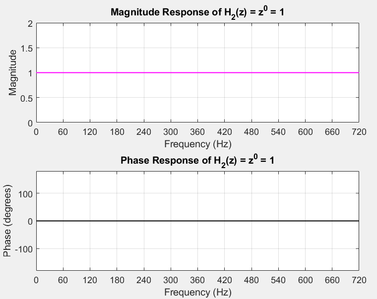
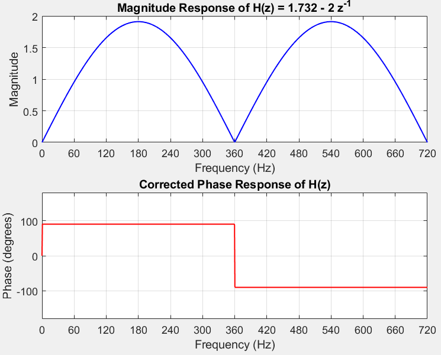

```
%%%%%%%%%%%%%%%%%%%%%%%%%%%%%%%%%%%%%%%%%%%%%%%%%%%%%%%%%

%% Initializing Variables with Parameters

fs = 720; % Sampling frequency

T = 1 / fs; % Sampling period

f = linspace(0, fs, 1000); % Frequency range for plotting

omega = 2 * pi * f; % Discrete angular frequency (radians/sample)

%%%%%%%%%%%%%%%%%%%%%%%%%%%%%%%%%%%%%%%%%%%%%%%%%%%%%%%%%

% --- H(z) REAL PART Vp COS(Theta) ---

z = exp(1j * omega * T);

H1 = 0.955 * z.^1 - 0.955 * z.^(-1);

mag = abs(H1);

phi = atan2(imag(H1), real(H1)) * 180 / pi;

%%%%%%%%%%%%%%%%%%%%%%%%%%%%%%%%%%%%%%%%%%%%%%%%%%%%%%%%%

% Plot magnitude and phase of H

figure;

subplot(2,1,1);

plot(f, mag, 'b', 'LineWidth', 1);

xlabel('Frequency (Hz)');

ylabel('Magnitude');

title('Magnitude Response of H(z) = 1.732 - 2 z^{-1}');

grid on;

xticks(0:60:720);

xlim([0 720]);

subplot(2,1,2);

plot(f, phi, 'r', 'LineWidth', 1);

xlabel('Frequency (Hz)');

ylabel('Phase (degrees)');

title('Corrected Phase Response of H(z)');

grid on;

xticks(0:60:720);

xlim([0 720]);

ylim([-180 180]);

%%%%%%%%%%%%%%%%%%%%%%%%%%%%%%%%%%%%%%%%%%%%%%%%%%%%%%%%%

% --- H2(z) IMAGINARY PART Vp Sin(Theta) ---

H2 = z.^0;

mag2 = abs(H2);

phi2 = atan2(imag(H2), real(H2)) * 180 / pi;

%%%%%%%%%%%%%%%%%%%%%%%%%%%%%%%%%%%%%%%%%%%%%%%%%%%%%%%%%

% Plot magnitude and phase of H2

figure;

subplot(2,1,1);

plot(f, mag2, 'm', 'LineWidth', 1);

xlabel('Frequency (Hz)');

ylabel('Magnitude');

title('Magnitude Response of H_2(z) = z^0 = 1');

grid on;

xticks(0:60:720);

xlim([0 720]);

subplot(2,1,2);

plot(f, phi2, 'k', 'LineWidth', 1);

xlabel('Frequency (Hz)');

ylabel('Phase (degrees)');

title('Phase Response of H_2(z) = z^0 = 1');

grid on;

xticks(0:60:720);

xlim([0 720]);

ylim([-180 180]);
```





