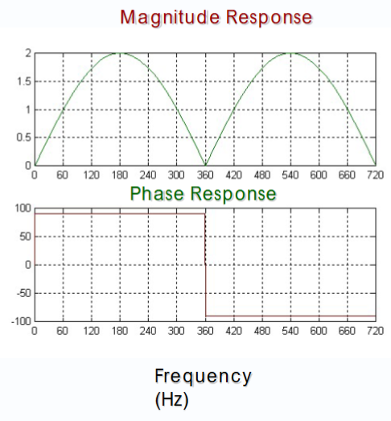
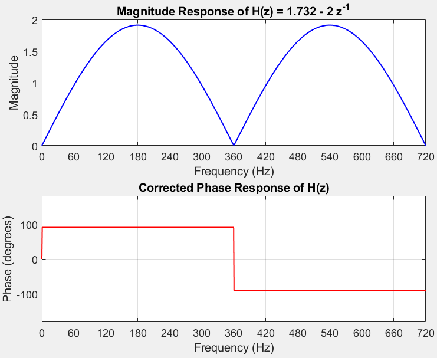

```
%%%%%%%%%%%%%%%%%%%%%%%%%%%%%%%%%%%%%%%%%%%%%%%%%%%%%%%%%

%% Initializing Variables with Parameters

fs = 720; % Sampling frequency

T = 1 / fs; % Sampling period

f = linspace(0, fs, 1000); % Frequency range for plotting

omega = 2 * pi * f; % Discrete angular frequency (radians/sample)

%%%%%%%%%%%%%%%%%%%%%%%%%%%%%%%%%%%%%%%%%%%%%%%%%%%%%%%%%

% --- H(z) REAL PART Vp COS(Theta) ---

z = exp(1j * omega * T);

H1_Real = 0.955 * z.^1 - 0.955 * z.^(-1);

mag_H1 = abs(H1_Real);

phase_angle_H1 = atan2(imag(H1_Real), real(H1_Real)) * 180 / pi;

%%%%%%%%%%%%%%%%%%%%%%%%%%%%%%%%%%%%%%%%%%%%%%%%%%%%%%%%%

% Plot magnitude and phase of H

figure;

subplot(2,1,1);

plot(f, mag_H1, 'b', 'LineWidth', 1);

xlabel('Frequency (Hz)');

ylabel('Magnitude');

title('Magnitude Response of H1(z) Real');

grid on;

xticks(0:60:fs);

xlim([0 fs]);

subplot(2,1,2);

plot(f, phase_angle_H1, 'r', 'LineWidth', 1);

xlabel('Frequency (Hz)');

ylabel('Phase (degrees)');

title('Phase Response of H1(z) Real');

grid on;

xticks(0:60:fs);

xlim([0 fs]);

yticks(-180:60:180);

ylim([-180 180]);

%%%%%%%%%%%%%%%%%%%%%%%%%%%%%%%%%%%%%%%%%%%%%%%%%%%%%%%%%

% --- H2(z) IMAGINARY PART Vp Sin(Theta) ---

H2_Imaginary = 3.648 * z.^1 - 7.295 * z.^(0) + 3.648* z.^(-1);

mag_H2 = abs(H2_Imaginary);

phase_angle_H2 = atan2(imag(H2_Imaginary), real(H2_Imaginary)) * 180 / pi;

%%%%%%%%%%%%%%%%%%%%%%%%%%%%%%%%%%%%%%%%%%%%%%%%%%%%%%%%%

% Plot magnitude and phase of H2

figure;

subplot(2,1,1);

plot(f, mag_H2, 'b', 'LineWidth', 1);

xlabel('Frequency (Hz)');

ylabel('Magnitude');

title('Magnitude Response of H2(z) Imaginary');

grid on;

xticks(0:60:fs);

xlim([0 fs]);

subplot(2,1,2);

plot(f, phase_angle_H2, 'r', 'LineWidth', 1);

xlabel('Frequency (Hz)');

ylabel('Phase (degrees)');

title('Phase Response of H2(z) Imaginary');

grid on;

xticks(0:60:fs);

xlim([0 fs]);

yticks(-180:60:180);

ylim([-180 180]);
```







